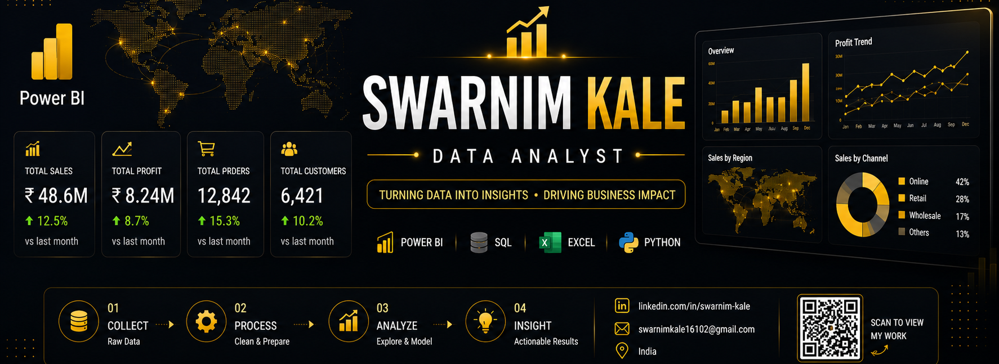

 

# 💫 About Me

Hi, I'm **Swarnim Kale**, an aspiring **Data Analyst** passionate about transforming raw data into meaningful business insights.

I enjoy building dashboards, analyzing business performance, discovering hidden trends, and solving real-world business problems through data.

I believe that every dataset tells a story, and my goal is to uncover that story using **Power BI, SQL, Excel, and Python**.

### 🚀 What I Do

- 📊 Build Interactive Dashboards
- 📈 Analyze Business Performance
- 📉 Create Dynamic Reports
- 🗄 SQL Data Analysis
- 🐍 Python for Analytics
- 📚 Continuous Learning

---

# 🎯 Career Objective

To become a skilled **Data Analyst** who helps organizations make smarter decisions using data-driven insights.

 

## 📊 Data Analytics

---
# 🚀 Featured Projects

| Project | Description | Tech Stack |
|---------|-------------|------------|
| 📦 **Warehouse Operations Analytics Dashboard** | Interactive Power BI dashboard for warehouse KPIs, inventory, sales & order analysis. | Power BI |
| 📊 **Social Media Campaign Analysis** | Interactive Power BI dashboard for analyzing social media campaign performance. | Power BI |
| 📈 **Excel Dashboard** | Dynamic reports using Pivot Tables, Charts & Slicers. | Microsoft Excel |
| 🗄️ **SQL Business Analysis** | SQL queries to solve real-world business problems and generate insights. | SQL, MySQL |
| 🌐 **Haven Analytics Dashboard** | Responsive analytics dashboard built using Chart.js. | HTML, CSS, JavaScript |
| 🐍 **Python Data Analysis** | Data Cleaning, EDA and Visualizations using Python. | Python, Pandas |

---
# 📚 Currently Working On

- 🔥 Building Professional Power BI Dashboards
- 📊 Learning Advanced DAX & Power Query
- 🐍 Python for Data Analytics
- 📈 Advanced SQL Queries
- 📦 Warehouse & Supply Chain Analytics
- 📊 End-to-End Analytics Projects
- 🚀 Strengthening GitHub Portfolio

---

# 🎯 2026 Goals

✔ Build **25+ Analytics Projects**

✔ Master **Power BI**

✔ Become Advanced in **SQL**

✔ Learn Advanced **Python**

✔ Contribute to Open Source

✔ Land a **Data Analyst** role

---
# 🏅 Certifications & Learning

📚 MCA Student

📊 Microsoft Power BI

📈 Advanced Excel

🗄 SQL & Database Management

🐍 Python for Data Analytics

📉 Statistics & Business Analytics

💡 Continuously learning new technologies in Data Analytics & Business Intelligence.

---
# 🌐 Connect With Me

---

## 💡 Quote

> **"Without data, you're just another person with an opinion."**  
> — W. Edwards Deming

---

## ⭐ Thanks for Visiting My Profile!

### If you like my work, don't forget to ⭐ my repositories.

